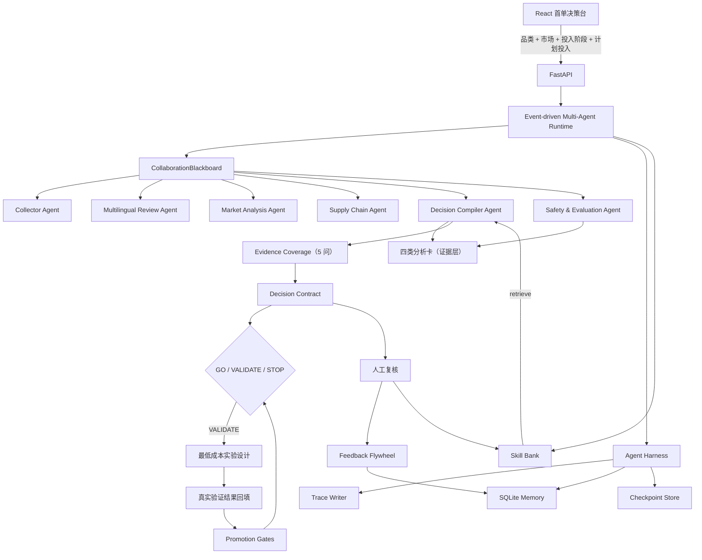

# 🧭 先机罗盘：跨境新品的 AI 首单投资决策台

> **Foresight Compass**：在卖家第一次不可逆投入前，判断证据是否足够；不够就设计最低成本验证，够了才 Go，并明确什么情况下必须 Stop。
>
> **我们不预测爆款，我们减少"还没验证就把钱变成库存"的错误。**

竞品交付市场研究报告，先机罗盘交付一份**决策契约（Decision Contract）**——可以拿去开首单评审会的 Go / Validate / Stop 决策，附带证据覆盖率、最大未知项、最低成本实验设计和明确 Stop 条件。

面向缺少海外研究团队的中小跨境卖家。系统不会在首轮就建议直接 Go——未经真实用户验证，先机罗盘永远不会建议直接投入。

[](backend/)
[](src/)
[](backend/foresight/api.py)
[](https://github.com/royd132/xianjiluopan/actions/workflows/ci.yml)
[](LICENSE)

---

## 📖 目录

1. [这个项目是什么](#-这个项目是什么)
2. [商家为什么会用](#-商家为什么会用)
3. [决策契约](#-决策契约)
4. [它解决什么问题](#-它解决什么问题)
5. [系统架构](#-系统架构)
6. [六大核心 Agent](#-六大核心-agent)
7. [Harness 与自进化](#-harness-与自进化)
8. [快速开始](#-快速开始)
9. [API 与离线 CLI](#-api-与离线-cli)
10. [关键代码](#-关键代码)
11. [项目结构](#-项目结构)
12. [测试与工程质量](#-测试与工程质量)
13. [文档导航](#-文档导航)
14. [路线图与边界](#-路线图与边界)

---

## 🤔 这个项目是什么

先机罗盘属于**场景三：AI 市场洞察**。它不是又一个市场数据看板，也不是 AI 选品推荐工具。它只回答一个问题：

> **卖家准备花第一笔不可逆的钱时，证据支持进入、先验证什么、还是应该停止？**

传统选品工具（Jungle Scout、卖家精灵等）回答”什么卖得好”；通用 AI 助手给出文字建议但没有证据链。先机罗盘的差异点是**决策编译**——把多源证据变成可执行的 Go / Validate / Stop，并告诉卖家什么情况下结论会失效。

一次任务生成四类标准化决策卡：

1. **选品方向卡** — 做什么差异才不卷价格
2. **定价策略卡** — 什么价格能覆盖物流+平台+获客成本
3. **竞争打法卡** — 首屏应该攻击哪个竞品空位
4. **最小市场验证卡** — 先找谁验证、样本量多少、什么情况下停止

每张卡都强制携带证据链、数据来源、置信度、有效期、反向条件、验证动作和人工复核状态。系统已在巴西宠物喂食器场景完成 Amazon/Olist/Comtrade/ECB/GSCPI/LSCI + Qwen 全链路真实数据闭环验证。


## 💼 商家为什么会用

| 决策时刻 | 卖家真正担心的事 | 先机罗盘交付 |
|---|---|---|
| 付样品费或开模前 | 当地需求是否成立，还是国内经验外推 | 选品卡：目标痛点、差异方向与停止条件 |
| 下首批订单前 | 价格能否覆盖物流、平台和获客成本 | 定价卡：价值锚、测试区间与毛利风险阈值 |
| 做详情页和投广告前 | 应该攻击哪个竞品空位 | 竞争卡：首屏证据、对比方法与防守动作 |
| 大批备货前 | 有没有一群真实用户愿意表达购买意向 | 最小市场验证卡：人群、渠道、样本量、验证问题和停止条件 |

产品不替卖家自动下采购单，而是在不可逆投入之前，把”我感觉能卖”改造成”哪些证据支持、先验证什么、什么情况下停止”。

## 📋 决策契约（Decision Contract）

竞品交付市场研究报告，先机罗盘交付一份**决策契约**——可以拿去开首单评审会的 Go / Validate / Stop 决策。

卖家输入：

```
产品：自动宠物喂食器
市场：巴西
决策阶段：首批备货
计划投入：¥30,000
```

系统输出：

| 字段 | 示例 |
|---|---|
| 决策 | **VALIDATE** |
| 计划投入 | ¥30,000 |
| 当前允许投入 | ≤ ¥2,000 |
| 证据成熟度 | 4 / 5 |
| 最大未知项 | 真实用户购买意向尚未验证 |
| 下一步实验 | 30 人价格 × 痛点对比测试 |
| 实验预算 | ¥2,000 |
| 晋级条件 | 样本量 ≥30，意向率 ≥12%，痛点确认率 ≥30% |
| Stop 条件 | CPC / 意向率 / 成本超过阈值 |
| 有效期 | 14 天 |
| 必须重算事件 | 汇率 / 运费 / 竞品价格变化超过阈值 |

### 产品原则

**未经真实用户验证，先机罗盘永远不会建议直接 Go。** 这是刻意设计的硬闸门——AI 无法凭市场数据越过。

```
计划投入 → 多源 Evidence → 6 Agents → 四张分析卡
                                      ↓
                              Evidence Coverage (5 问)
                                      ↓
                              Decision Contract
                              ┌────┼────────┐
                             GO  VALIDATE   STOP
                                  ↓
                           最低成本实验
                                  ↓
                           真实验证结果
                           (metrics-driven)
                                  ↓
                           重新决策 → GO / STOP
```

### 验证结果回填

当用户完成最小验证后，提交结构化指标（样本量、意向率、CPC、痛点确认率），系统按 `ValidationCriteria` 自动判定 Go / Stop。人工可以覆盖系统判定，但 `system_verdict` 和 `human_override` 会分开记录。

### 证据覆盖率

系统不输出”机会评分 87/100”。而是检查 5 个必答问题：

1. 需求是否真实？
2. 消费者痛点是否明确？
3. 目标价格是否成立？
4. 供应链外部风险是否可控？
5. 最小验证是否完成？

前 4 个可以通过市场数据回答，第 5 个**必须**有真实用户验证数据。

## 🎯 它解决什么问题

| 业务痛点 | 常见做法 | 先机罗盘 |
|---|---|---|
| 数据分散 | 在趋势、平台、评论、海关和物流网站间切换 | Collector Agent 统一采集并形成事实层 |
| 非英语评论难利用 | 先翻译再做简单情感分析 | Review Agent 保留原语；BR 真实模式接入 Olist 葡语评论，Qwen 抽取结果必须回指源记录 |
| 指标不能直接行动 | 人工拼装选品、定价和竞争判断 | Decision Compiler 生成四类行动卡 |
| AI 建议像黑盒 | 只看到结论，无法核查来源 | 每张卡绑定证据、时间和置信度 |
| 报告很快过期 | 依靠人重新查询 | 当前登记反向条件；定时增量任务完成后按快照变化触发重算 |
| Agent 难治理 | 失败后从头跑，过程不可见 | Harness 提供 Trace、Memory 与 Checkpoint |

## ✨ 项目状态

当前仓库已经包含一条可以离线复现的完整工程链路，而不是只有界面稿：

- React 首单决策台；
- FastAPI REST 与 SSE 服务；
- 事件驱动 `CollaborationBlackboard`；
- 6 个职责明确的 Agent；
- Harness 工具治理、Trace、Memory 与 Checkpoint；
- 可配置 Provider 注册与热更新；
- 任务级组件快照；
- 四类决策卡 Schema 和安全评测闸门；
- 多语言隐性痛点分析；
- 供应链信号与反向条件；
- 人工复核反馈沉淀；
- CLI 离线报告生成；
- Python 自动化测试。

默认仍可使用**场景化确定性 Mock**验证多品类、多市场链路；本地数据缓存和 Qwen 配置齐全时，Runtime 同时开放 `hybrid` 与 `real`。BR × 自动宠物喂食器已跑通 Amazon 商品/评论、Olist 葡语评论与成交、Comtrade、ECB 汇率、NY Fed GSCPI、World Bank LSCI 和 Qwen 的完整真实链路。

| 能力状态 | 已实现 | 下一阶段 |
|---|---|---|
| 决策工作流 | 六 Agent、四卡、证据链、反向条件、人工复核 | 商家共创优化卡片字段与行业模板 |
| 冷启动数据 | Mock / Hybrid / Real 三模式；BR 主场景真实闭环 | 当前 listing 授权源、MY 原语数据和定时增量 |
| 实时能力 | SSE 推送任务执行事件；手动市场快照与阈值触发计数 | 后台定时增量与通知投递 |
| 自进化 | 反馈案例、策略候选、Validation/Holdout、人工激活与回滚；Skill Bank 候选抽取、BM25 检索、评测与激活 | 合规样本充足后评估模型优化 |

## 🏗 系统架构



### 请求处理流程

```text
① 输入品类 × 目标国家 × 投入阶段 × 计划投入金额
        ↓
② Collector 发布原始数据与证据
        ↓
③ Review / Market / Supply Chain 三 Agent 并行分析
        ↓
④ Decision Compiler 编译四类分析卡 + Evidence Coverage + Decision Contract
        ↓
⑤ Safety Evaluator 执行强制闸门
        ↓
⑥ SSE 推送进度，React 首先展示 Go / Validate / Stop 决策契约
        ↓
⑦ 若 VALIDATE → 用户执行最小验证 → 提交指标 → 系统按 Promotion Gates 重判
        ↓
⑧ 人工复核写入正向/负向案例记忆
```

## 🤖 六大核心 Agent

| Agent | 责任 | 主要产物 |
|---|---|---|
| Collector Agent | 采集趋势、评论、价格、贸易和运价数据 | 原始市场数据、证据对象 |
| Multilingual Review Agent | 保留原语评论；Qwen 只返回源 review ID，代码取回原文 | 痛点簇、原文引用与 Prompt 指纹 |
| Market Analysis Agent | 计算价格分位、竞争密度和机会指标 | 结构化市场指标 |
| Supply Chain Agent | 计算贸易、运价和汇率领先信号 | 供应链风险与阈值状态 |
| Decision Compiler Agent | 将带模式标识的证据编译为四类行动卡 | 决策卡草稿 |
| Safety & Evaluation Agent | Mock 校验结构完整性；真实模式还必须校验证据核实状态 | 通过或拒绝输出 |

Runtime 采用分阶段并行：采集完成后，评论分析、市场分析和供应链分析并行工作；随后决策编译与安全评测依次完成。Agent 通过黑板发布 Artifact 和事件，不直接相互调用。

### 为什么使用 Blackboard 而不是 Agent 互相调用？

- 避免 Agent 之间形成循环依赖；
- 中间 Artifact 可审计、可复用；
- 无依赖节点可以自然并行；
- 单个 Agent 可独立重试或降级；
- 新 Agent 只需声明输入与输出，不必修改其他 Agent。

## 🤖 百炼 Qwen 模型集成

先机罗盘通过阿里云百炼 Qwen 3.7 模型实现多语言评论隐性痛点抽取。关键在于 **Grounding 机制**——模型不能编造市场事实：

```
原语评论 (葡语/西班牙语/英语)
       ↓
Qwen 3.7 Flash (DashScope API, OpenAI 兼容协议)
       ↓  结构化输出约束 (JSON Schema)
模型只返回: {pain_type, label, review_ids: ["r001", "r002"], mentions, sample_original}
       ↓  代码根据 review_id 取回原文
EvidenceItem (source_record_ids 回指源记录, verified=true)
       ↓
DecisionCard (每条证据可追溯到具体用户的原话)
```

每次调用记录 prompt 指纹、模型版本和 adapter 版本。Real 模式下，如果 Qwen 调用失败或返回不合规结构，任务直接拒绝，不会用规则回退冒充模型结果。Hybrid 模式允许规则回退，但回退范围必须在输出中明确披露。

## 🧠 Harness 与自进化

先机罗盘采用 **可恢复 Agent 运行内核 + 扁平工具注册表**。

| 模块 | 当前实现 | 作用 |
|---|---|---|
| Run Ledger | SQLite 追加事件 | 统一记录节点、Agent、工具、Checkpoint、反馈与失败 |
| Node Runtime | 状态机 + 重试/超时/取消 | 按 collect / analyze / compile / validate 节点可靠执行 |
| Memory Store | SQLite | 保存研究结果、复核卡片、分类反馈和失败案例 |
| Checkpoint | JSON 快照 + 节点状态 | 服务重启后恢复 Blackboard，并跳过已完成节点 |
| Tool Registry | 扁平注册 + 全局 Guard | 工具注册与权限控制 |
| Capability Guard | Allowlist 权限 | 工具访问控制 |
| Component Snapshot | 插件、工具和策略版本 SHA-256 | 任务级组件快照 |
| Evaluation Gate | Pydantic + 分层规则 | Mock 走结构门禁；真实模式增加已核实证据门禁 |
| Policy Evolution | 外置合成 DecisionCard 双分区回放 | 候选经过共享门禁后才能人工激活 |

Provider 可通过 API 热更新，当前活动版本持久化到 Memory。自进化飞轮完成反馈收集、失败案例沉淀、候选策略生成、外置合成决策卡 Validation/Holdout 回放、人工激活与版本回滚。

## 🚀 快速开始

### 方式一：Docker Compose

```bash
git clone https://github.com/royd132/xianjiluopan.git
cd xianjiluopan
docker compose up --build
```

- 工作台：`http://localhost:4173`
- OpenAPI：`http://localhost:8000/docs`

### 方式二：本地开发

### 1. 安装前端依赖

```powershell
npm.cmd install --cache .npm-cache
```

### 2. 启动后端

```powershell
$env:PYTHONPATH="backend"
python -m uvicorn foresight.api:app --host 0.0.0.0 --port 8000
```

API 文档：`http://localhost:8000/docs`

### 3. 启动前端

```powershell
npm.cmd run dev -- --port 4173
```

工作台：`http://localhost:4173`

也可以运行：

```powershell
.\scripts\run_demo.ps1
```

前端会自动检测后端：连接成功时消费真实 SSE 事件；后端未启动时自动降级为本地演示模式。

### 真实数据 + Qwen 报告

先下载本地数据缓存，并在 `.env` 配置 `QWEN_API_KEY`。API 启动时会自动读取仓库根目录的 `.env`：

```powershell
pip install -e ".[data]"
.\scripts\data\download_all.ps1
.\scripts\run_real_report.ps1 -Category "pet feeder" -Market BR
```

`real` 模式不允许模型失败后静默回退；`hybrid` 才允许规则抽取或明确标注的冷启动补位。原始数据因许可与体积原因不提交到 Git，下载脚本和来源清单可复现。

公开部署时建议保护所有运行时变更接口：

```powershell
$env:FORESIGHT_ADMIN_TOKEN="replace-with-a-secret"
# 或将演示环境设为完全只读
$env:FORESIGHT_DEMO_READ_ONLY="true"
```

启用令牌后，Provider 更新、任务取消/恢复、卡片复核和策略演进请求必须携带 `X-Admin-Token`。研究任务创建与只读查询保持可用。

## 🔌 API 与离线 CLI

### 核心接口

| 方法 | 路径 | 说明 |
|---|---|---|
| GET | `/api/v1/health` | Runtime 健康检查 |
| GET | `/api/v1/monitoring?category=&market=` | 读取市场信号快照、观察日期与阈值触发数 |
| POST | `/api/v1/research` | 创建研究任务 |
| GET | `/api/v1/research/{id}` | 查询状态和四卡结果 |
| GET | `/api/v1/research/{id}/events` | SSE 事件流 |
| GET | `/api/v1/research/{id}/checkpoint` | 获取最近 Checkpoint |
| GET | `/api/v1/research/{id}/run-events` | 获取持久化 Run Ledger |
| POST | `/api/v1/research/{id}/cancel` | 请求取消任务 |
| POST | `/api/v1/research/{id}/resume` | 从最近 Checkpoint 恢复任务 |
| POST | `/api/v1/cards/{id}/review` | 写入人工复核反馈 |
| GET | `/api/v1/evolution` | 查询失败案例、策略版本和评测结果 |
| POST | `/api/v1/evolution/candidates` | 生成候选并执行双分区回放 |
| POST | `/api/v1/evolution/policies/{version}/activate` | 激活已通过门禁的策略 |
| POST | `/api/v1/evolution/rollback` | 回滚到父策略版本 |
| GET | `/api/v1/skills` | 查询 Skill Bank 状态与列表 |
| GET | `/api/v1/skills/retrieve?category=&market=` | 检索匹配当前研究上下文的活跃 Skill |
| POST | `/api/v1/skills/{id}/evaluate` | 对候选 Skill 执行 Validation/Holdout 回放评测 |
| POST | `/api/v1/skills/{id}/promote` | 人工激活已通过门禁的 Skill |
| POST | `/api/v1/skills/{name}/rollback` | 回滚到父版本 Skill |
| GET | `/api/v1/runtime/extensions` | 查看活动和退役的插件 generation |
| POST | `/api/v1/runtime/providers/mock/reload` | 热更新内置 Mock Provider |
| GET | `/api/v1/research/{id}/component-snapshot` | 查看任务的插件、工具和策略版本 |
| POST | `/api/v1/contracts/{id}/validate-result` | 提交验证结果，系统按指标重新判定 Go/Stop |

### 离线 CLI

无需启动 Web 服务即可生成完整 JSON 报告：

```powershell
$env:PYTHONPATH="backend"
python -m foresight "宠物自动喂食器" --market BR --output reports\demo.json
```

输出包含四张决策卡、证据、痛点、供应链信号、完成的 Agent、任务时间和 Trace ID。

## 💻 关键代码

### 阶段并行编排

```python
# backend/foresight/runtime.py
await collector.execute(request, board, self.harness, trace_id)
await self._checkpoint(task_id, "collected", board, trace_id)

await run_parallel(
    [MultilingualReviewAgent(), MarketAnalysisAgent(), SupplyChainAgent()],
    request,
    board,
    self.harness,
    trace_id,
)

await DecisionCompilerAgent().execute(request, board, self.harness, trace_id)
await SafetyEvaluationAgent().execute(request, board, self.harness, trace_id)
```

### 安全评测闸门

```python
# backend/foresight/agents.py
if len(card.evidences) < 3:
    failures.append("missing evidence")
if not card.private_domain_hook.hook_message:
    failures.append("missing private domain hook")
if not card.failure_conditions:
    failures.append("missing failure condition")
if not any(e.language != "en" for e in card.evidences):
    failures.append("missing non-English evidence")
```

这意味着模型不能凭一段看起来合理的文字绕过产品约束；必要字段不完整时，Runtime 不发布最终卡片。

## ✅ 测试与工程质量

```powershell
$tmp=(Resolve-Path '.').Path + '\.tmp'
New-Item -ItemType Directory -Force -Path $tmp | Out-Null
$env:TEMP=$tmp
$env:TMP=$tmp
python -m pytest
npm.cmd run test:frontend
npm.cmd run build
```

测试覆盖离线多 Agent 任务、四卡 Schema、事件序列、Checkpoint、反馈记忆、权限 Guard、插件失败清理、Provider 热更新、组件快照、Decision Contract Go/Validate/Stop 判定、验证结果回填、metrics-driven 晋升门禁、人工覆盖记录、API 健康检查、公开信号 Connector 合同与前端 Runtime 映射。

仓库还包含：

- GitHub Actions 前后端 CI；
- Python `pyproject.toml` 标准打包；
- 前后端 Dockerfile 与 Compose；
- `.env.example`，离线模式无需密钥；
- MIT License；
- 响应式浏览器工作台与 API 自动降级。

## 📁 项目结构

```text
.
├── backend/foresight/
│   ├── agents.py       # 六类 Agent
│   ├── api.py          # FastAPI App Factory
│   ├── api_routes.py   # REST + SSE 路由
│   ├── api_dependencies.py # Runtime 注入与管理权限
│   ├── data.py         # Mock/真实数据 Provider 扩展点
│   ├── events.py       # Blackboard 与事件协议
│   ├── evolution.py    # 反馈、策略候选、评测、激活与回滚
│   ├── extensions.py   # 工具注册、Guard、插件管理与组件快照
│   ├── harness.py      # Trace/Memory/Run Ledger/Checkpoint 持久化
│   ├── harness_runtime.py # 节点恢复、工具调用与组件快照执行器
│   ├── models.py       # Pydantic 领域模型
│   ├── policy.py       # 线上运行与离线回放共用的生产门禁
│   ├── providers/      # 汇率、贸易、GSCPI、LSCI 等源级 Connector
│   └── runtime.py      # 多 Agent 编排器
├── src/
│   ├── api/            # 前端 API Client
│   └── features/       # 研究配置、映射与 SSE Hook
├── tests/              # 后端自动化测试
├── frontend-tests/     # Node 前端领域映射测试
├── docs/               # 架构、协议、比赛与演示文档
├── deliverables/       # 初赛 PDF、使用教程、图示、截图与提交 ZIP
├── scripts/            # 本地运行脚本
├── pyproject.toml
└── package.json
```

## 📚 文档导航

- [初赛完整提交包](deliverables/初赛提交包/README_提交说明.md)（方案 PDF、完整使用教程、架构图、流程图与真实任务截图）
- [初赛提交 ZIP](deliverables/先机罗盘_菜菜唠唠_初赛提交包.zip)
- [系统架构](docs/系统架构.md)
- [Agent 与事件协议](docs/Agent与事件协议.md)
- [Harness、热插拔与受控自进化 v3](docs/Harness与自进化_v3.md)
- [综合架构评审与重构路线（AutoSkill / 主流 Harness / 获奖 Agent 对照）](docs/综合架构评审与重构路线_2026-08.md)
- [真实数据、冷启动与证据边界](docs/真实数据与冷启动.md)
- [开发与扩展指南](docs/开发指南.md)
- [原始完整 PRD](docs/PRD_先机罗盘_v1.0.md)
- [产品与商业价值](docs/产品与商业价值.md)
- [初赛提交材料](docs/初赛提交材料.md)
- [演示脚本](docs/演示脚本.md)
- [评审问答与提交检查表](docs/评审问答与提交检查表.md)
- [巴西宠物喂食器示例报告](reports/demo.json)
- [美国咖啡磨跨场景示例报告](reports/demo_us_coffee.json)
- [墨西哥便携榨汁机跨场景示例报告](reports/demo_mx_blender.json)
- [美国降噪耳机跨场景示例报告](reports/demo_us_headphones.json)

## 🗺 路线图与边界

### 数据模式

| 模式 | 状态 | 说明 |
|---|---|---|
| `mock` | 已实现 | 品类画像 × 市场画像的确定性冷启动，证据统一标记 `mock` |
| `hybrid` | 已实现 | 公开数据优先；模型失败可规则回退，回退范围写入结果 |
| `real` | 已实现 | 要求数据缓存、Qwen 和源记录回指同时成立，否则拒绝任务 |

Mock 数据不会冒充真实发现。页面、API 和导出结果均披露数据模式。`/api/v1/health` 同时返回市场 × 品类能力矩阵，区分真实模式阻断项与已知数据缺口；页面只在当前组合满足合同时开放 `real`。

证据读取时间不等于数据发生时间。每条真实证据包含观察日期/区间、时间属性和市场适用范围；历史快照、结构性基线、跨市场评论与目标市场证据在 UI 中分别标记。

### 自进化边界

仓库已实现受控自进化飞轮的策略层闭环：

- Layer 1：采纳、驳回、待议等运行时反馈收集；
- Layer 2：正向/负向案例写入长期记忆，为后续检索与评测提供数据。
- Layer 3a：版本化策略候选、外置合成 DecisionCard Validation/Holdout 回放、人工激活与父版本回滚。
- Layer 3b：Skill Bank 最小闭环——从人工反馈中抽取可复用检查模式，经 BM25 检索注入后续任务，通过 Validation/Holdout 回放评测后人工激活，支持版本回滚。

Prompt/Skill 自动优化、SFT、LoRA 和强化学习属于数据积累后的模型演进路线，不会在没有合规样本的情况下伪装成已经完成的能力。

### 合规原则

- AI 生成内容强制披露并要求人工复核；
- 每条决策保留来源、采集时间和证据；
- 评论数据按需脱敏，不采集无关个人信息；
- 数据不足时降级或拒绝输出；
- 系统不自动采购、调价、投放或发送私信；
- 密钥只存在服务端环境变量，不进入仓库。

### Roadmap

- [x] 离线多 Agent Runtime
- [x] 四类 Decision Cards
- [x] FastAPI + SSE + React Workbench
- [x] Trace / Memory / Checkpoint / Feedback Flywheel
- [x] 可恢复节点 Runtime、Run Ledger 与工具注册表
- [x] 策略候选、Validation/Holdout 门禁、激活与回滚
- [x] Tool Registry、Capability Guard 与组件快照
- [x] Provider 热更新与任务级组件快照
- [x] 场景化多品类 × 多市场 Mock 冷启动
- [x] 外置合成 DecisionCard 共享门禁回放与数据指纹
- [x] Docker 与 CI
- [x] ECB / UN Comtrade / GSCPI / LSCI / Amazon / Olist 真实 Provider
- [ ] 定时市场快照、变化检测与阈值告警
- [x] 可替换 Qwen Model Adapter、结构化输出与源记录 Grounding
- [x] Skill Bank 最小闭环：候选抽取、BM25 检索、Validation/Holdout 评测、人工激活与回滚
- [x] Decision Contract：首单投资决策 Go/Validate/Stop、证据覆盖率、验证结果回填与 metrics-driven 判定
- [ ] Chroma/Qdrant 双塔检索
- [ ] 生产任务队列和分布式事件总线
- [ ] 基于合规反馈样本的 Layer 3 模型演进

---

## 🔒 安全说明

- 仓库不包含真实 API Key、Token 或用户数据；
- `.env.example` 仅包含空占位符；
- Mock 数据在页面、API 和报告中明确标记；
- 系统不自动采购、投放、调价或发送私信；
- 接入真实平台时应遵守接口许可、平台条款与隐私法规。

## 📄 License

[MIT License](LICENSE)

---

<div align="center">

**不预测爆款，只减少"还没验证就把钱变成库存"的错误。**

</div>
