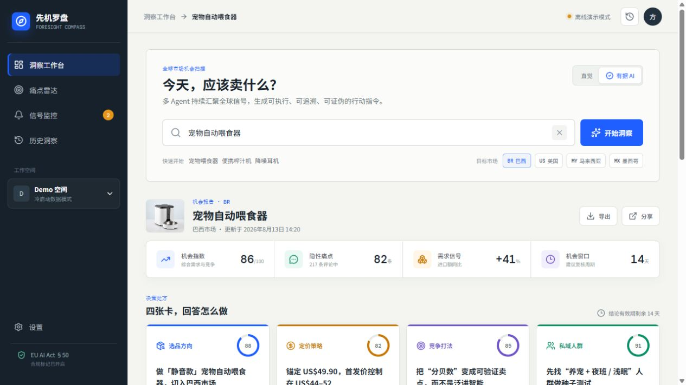
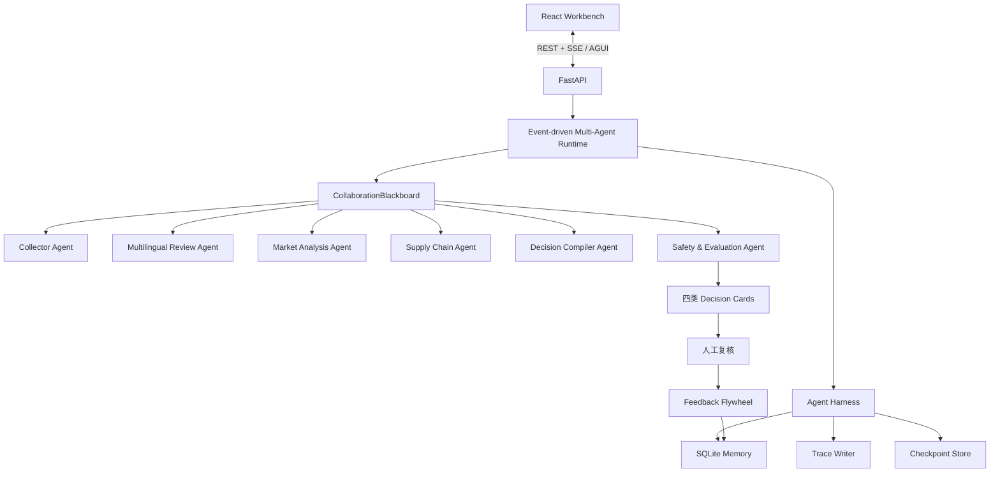

# 🧭 先机罗盘 · Foresight Compass

> **面向中小跨境卖家的新品立项决策系统** — 在付样品费、开模或下首批订单前，把趋势、竞品、原语评论和供应链信号编译成可验证的选品、定价与竞争决策。

[](backend/)
[](src/)
[](backend/foresight/api.py)
[](https://github.com/royd132/xianjiluopan/actions/workflows/ci.yml)
[](LICENSE)

---

## 📖 目录

1. [这个项目是什么](#-这个项目是什么)
2. [商家为什么会用](#-商家为什么会用)
3. [它解决什么问题](#-它解决什么问题)
4. [系统架构](#-系统架构)
5. [六大核心 Agent](#-六大核心-agent)
6. [Harness、热插拔与自进化](#-harness热插拔与自进化)
7. [快速开始](#-快速开始)
8. [API 与离线 CLI](#-api-与离线-cli)
9. [关键代码](#-关键代码)
10. [项目结构](#-项目结构)
11. [测试与工程质量](#-测试与工程质量)
12. [文档导航](#-文档导航)
13. [路线图与边界](#-路线图与边界)

---

## 🤔 这个项目是什么

先机罗盘属于**场景三：AI 市场洞察**。它聚焦一个具体业务问题：中小卖家进入陌生国家前，如何不用个人经验拼凑零散数据，就完成一次可追溯的 `Go / Validate / Stop` 新品立项判断。

当前原型按需执行一次研究任务；产品路线再通过真实 Provider、定时快照和阈值触发器升级为持续监控。一次任务会生成四类标准化决策卡：

1. 选品方向；
2. 定价策略；
3. 竞争打法；
4. 私域人群与承接钩子。

每张卡都强制携带证据链、数据来源、置信度、有效期、反向条件、私域落点和人工复核状态。系统不仅告诉卖家“怎么做”，还说明“为什么这样做”和“什么时候这项结论会失效”。



## 💼 商家为什么会用

| 决策时刻 | 卖家真正担心的事 | 先机罗盘交付 |
|---|---|---|
| 付样品费或开模前 | 当地需求是否成立，还是国内经验外推 | 选品卡：目标痛点、差异方向与停止条件 |
| 下首批订单前 | 价格能否覆盖物流、平台和获客成本 | 定价卡：价值锚、测试区间与毛利风险阈值 |
| 做详情页和投广告前 | 应该攻击哪个竞品空位 | 竞争卡：首屏证据、对比方法与防守动作 |
| 大批备货前 | 有没有一群真实用户愿意表达购买意向 | 种子验证卡：找谁、在哪找、第一句话说什么 |

产品不替卖家自动下采购单，而是在不可逆投入之前，把“我感觉能卖”改造成“哪些证据支持、先验证什么、什么情况下停止”。首轮试点将重点验证调研时长、决策卡采纳率、证据可追溯率和备货前验证完成率，不把预期指标包装成已实现商业结果。

## 🎯 它解决什么问题

| 业务痛点 | 常见做法 | 先机罗盘 |
|---|---|---|
| 数据分散 | 在趋势、平台、评论、海关和物流网站间切换 | Collector Agent 统一采集并形成事实层 |
| 非英语评论难利用 | 先翻译再做简单情感分析 | Review Agent 保留原语让步结构；当前 Mock 复现结构化结果，真实语义模型通过 Adapter 接入 |
| 指标不能直接行动 | 人工拼装选品、定价和营销判断 | Decision Compiler 生成四类行动卡 |
| AI 建议像黑盒 | 只看到结论，无法核查来源 | 每张卡绑定证据、时间和置信度 |
| 报告很快过期 | 依靠人重新查询 | 当前登记反向条件；真实 Provider 接入后按快照变化触发重算 |
| Agent 难治理 | 失败后从头跑，过程不可见 | Harness 提供 Trace、Memory 与 Checkpoint |

## ✨ 项目状态

当前仓库已经包含一条可以离线复现的完整工程链路，而不是只有界面稿：

- React 洞察工作台；
- FastAPI REST 与 SSE 服务；
- 事件驱动 `CollaborationBlackboard`；
- 6 个职责明确的 Agent；
- Harness 工具治理、Trace、Memory 与 Checkpoint；
- DSH 式作用域扩展平面、可逆插件生命周期与 Provider 热更新；
- 任务级组件快照，运行中任务锁定 Provider、工具和策略版本；
- 四类决策卡 Schema 和安全评测闸门；
- 多语言隐性痛点分析；
- 供应链信号与反向条件；
- 人工复核反馈沉淀；
- CLI 离线报告生成；
- Python 自动化测试。

默认使用**场景化确定性 Mock**：品类画像与市场画像共同决定评论痛点、价格带、竞品空位、种子渠道和供应链信号。目前内置 BR、US、MY、MX 四个市场，以及宠物喂食器、便携榨汁机、降噪耳机、咖啡磨豆机和通用品类画像，不需要 API Key 也能验证跨场景链路。真实模型与真实数据源通过 Provider/Agent 适配器逐步接入。

| 能力状态 | 已实现 | 下一阶段 |
|---|---|---|
| 决策工作流 | 六 Agent、四卡、证据链、反向条件、人工复核 | 商家共创优化卡片字段与行业模板 |
| 冷启动数据 | 多品类 × 多市场一致性 Mock | 授权趋势、评论、价格、贸易和物流 Provider |
| 实时能力 | SSE 推送任务执行事件 | 定时市场快照、变化检测、阈值告警 |
| 自进化 | 反馈案例、策略候选、Validation/Holdout、人工激活与回滚 | 合规样本充足后评估 Prompt/Skill 或模型优化 |

## 🏗 系统架构



### 请求处理流程

```text
① 输入品类 × 目标国家
        ↓
② Collector 发布原始数据与证据
        ↓
③ Review / Market / Supply Chain 三 Agent 并行分析
        ↓
④ Decision Compiler 编译四类决策卡
        ↓
⑤ Safety Evaluator 执行强制闸门
        ↓
⑥ SSE 推送进度，React 呈现结果
        ↓
⑦ 人工复核写入正向/负向案例记忆
```

## 🤖 六大核心 Agent

| Agent | 责任 | 主要产物 |
|---|---|---|
| Collector Agent | 采集趋势、评论、价格、贸易和运价数据 | 原始市场数据、证据对象 |
| Multilingual Review Agent | 保留原语评论并抽取让步结构；Mock 模式复现预置分析结果 | 痛点簇、原文引用 |
| Market Analysis Agent | 计算价格分位、竞争密度和机会指标 | 结构化市场指标 |
| Supply Chain Agent | 计算贸易、运价和汇率领先信号 | 供应链风险与阈值状态 |
| Decision Compiler Agent | 将带模式标识的证据编译为四类行动卡 | 决策卡草稿 |
| Safety & Evaluation Agent | Mock 校验结构完整性；真实模式还必须校验证据核实状态 | 通过或拒绝输出 |

Runtime 采用分阶段并行：采集完成后，评论分析、市场分析和供应链分析并行工作；随后决策编译与安全评测依次完成。Agent 通过黑板发布 Artifact 和事件，不直接相互调用。

### 为什么使用 Blackboard 而不是 Agent 互相调用？

- 避免 Agent 之间形成循环依赖；
- 中间 Artifact 可审计、可复用；
- 无依赖节点可以自然并行；
- 单个 Agent 可独立重试或降级；
- 新 Agent 只需声明输入与输出，不必修改其他 Agent。

## 🧠 Harness、热插拔与自进化

先机罗盘采用 **可恢复 Agent 运行内核 + DSH 式扩展平面**。节点恢复、Run Ledger 和演进门禁保持稳定；Provider、Tool、Evaluator、Policy Pack 与 Agent Adapter 位于可替换层。

| 模块 | 当前实现 | 作用 |
|---|---|---|
| Run Ledger | SQLite 追加事件 | 统一记录节点、Agent、工具、Checkpoint、反馈与失败 |
| Node Runtime | 状态机 + 重试/超时/取消 | 按 collect / analyze / compile / validate 节点可靠执行 |
| Memory Store | SQLite | 保存研究结果、复核卡片、分类反馈和失败案例 |
| Checkpoint | JSON 快照 + 节点状态 | 服务重启后恢复 Blackboard，并跳过已完成节点 |
| Scoped Tool Registry | global / workspace / market / task 分层遮蔽 | 同名能力按最近作用域解析 |
| Effect Stack | 注册副作用逆序撤销 | 插件安装失败或回滚时自动清理 |
| Capability Guard | 单调权限拒绝 | 局部插件不能恢复已禁止工具 |
| Component Snapshot | 插件、工具和策略版本 SHA-256 | 热更新只影响新任务，旧任务可复现和恢复 |
| Evaluation Gate | Pydantic + 分层规则 | Mock 走结构门禁；真实模式增加已核实证据门禁 |
| Policy Evolution | 外置合成 DecisionCard 双分区回放 | 候选经过共享门禁后才能人工激活 |

Provider 更新采用 `staging -> health check -> activate`，旧 generation 保留给已启动任务。服务重启时 Runtime 按组件快照重建所需 generation，当前活动 Provider 版本也会持久化。自进化飞轮完成反馈收集、失败案例沉淀、候选策略生成、外置合成决策卡 Validation/Holdout 回放、人工激活与版本回滚；商家审核案例尚在试点阶段积累。

## 🚀 快速开始

### 方式一：Docker Compose

```bash
git clone https://github.com/royd132/xianjiluopan.git
cd xianjiluopan
docker compose up --build
```

- 工作台：`http://localhost:4173`
- OpenAPI：`http://localhost:8000/docs`

### 方式二：本地开发

### 1. 安装前端依赖

```powershell
npm.cmd install --cache .npm-cache
```

### 2. 启动后端

```powershell
$env:PYTHONPATH="backend"
python -m uvicorn foresight.api:app --host 0.0.0.0 --port 8000
```

API 文档：`http://localhost:8000/docs`

### 3. 启动前端

```powershell
npm.cmd run dev -- --port 4173
```

工作台：`http://localhost:4173`

也可以运行：

```powershell
.\scripts\run_demo.ps1
```

前端会自动检测后端：连接成功时消费真实 SSE 事件；后端未启动时自动降级为本地演示模式。

公开部署时建议保护所有运行时变更接口：

```powershell
$env:FORESIGHT_ADMIN_TOKEN="replace-with-a-secret"
# 或将演示环境设为完全只读
$env:FORESIGHT_DEMO_READ_ONLY="true"
```

启用令牌后，Provider 更新、任务取消/恢复、卡片复核和策略演进请求必须携带 `X-Admin-Token`。研究任务创建与只读查询保持可用。

## 🔌 API 与离线 CLI

### 核心接口

| 方法 | 路径 | 说明 |
|---|---|---|
| GET | `/api/v1/health` | Runtime 健康检查 |
| POST | `/api/v1/research` | 创建研究任务 |
| GET | `/api/v1/research/{id}` | 查询状态和四卡结果 |
| GET | `/api/v1/research/{id}/events` | SSE 事件流 |
| GET | `/api/v1/research/{id}/checkpoint` | 获取最近 Checkpoint |
| GET | `/api/v1/research/{id}/run-events` | 获取持久化 Run Ledger |
| POST | `/api/v1/research/{id}/cancel` | 请求取消任务 |
| POST | `/api/v1/research/{id}/resume` | 从最近 Checkpoint 恢复任务 |
| POST | `/api/v1/cards/{id}/review` | 写入人工复核反馈 |
| GET | `/api/v1/evolution` | 查询失败案例、策略版本和评测结果 |
| POST | `/api/v1/evolution/candidates` | 生成候选并执行双分区回放 |
| POST | `/api/v1/evolution/policies/{version}/activate` | 激活已通过门禁的策略 |
| POST | `/api/v1/evolution/rollback` | 回滚到父策略版本 |
| GET | `/api/v1/runtime/extensions` | 查看活动和退役的插件 generation |
| POST | `/api/v1/runtime/providers/mock/reload` | 热更新内置 Mock Provider，新任务生效 |
| POST | `/api/v1/runtime/providers/mock/rollback` | 回滚内置 Provider generation |
| GET | `/api/v1/research/{id}/component-snapshot` | 查看任务固定的插件、工具和策略版本 |

### 离线 CLI

无需启动 Web 服务即可生成完整 JSON 报告：

```powershell
$env:PYTHONPATH="backend"
python -m foresight "宠物自动喂食器" --market BR --output reports\demo.json
```

输出包含四张决策卡、证据、痛点、供应链信号、完成的 Agent、任务时间和 Trace ID。

## 💻 关键代码

### 阶段并行编排

```python
# backend/foresight/runtime.py
await collector.execute(request, board, self.harness, trace_id)
await self._checkpoint(task_id, "collected", board, trace_id)

await run_parallel(
    [MultilingualReviewAgent(), MarketAnalysisAgent(), SupplyChainAgent()],
    request,
    board,
    self.harness,
    trace_id,
)

await DecisionCompilerAgent().execute(request, board, self.harness, trace_id)
await SafetyEvaluationAgent().execute(request, board, self.harness, trace_id)
```

### 安全评测闸门

```python
# backend/foresight/agents.py
if len(card.evidences) < 3:
    failures.append("missing evidence")
if not card.private_domain_hook.hook_message:
    failures.append("missing private domain hook")
if not card.failure_conditions:
    failures.append("missing failure condition")
if not any(e.language != "en" for e in card.evidences):
    failures.append("missing non-English evidence")
```

这意味着模型不能凭一段看起来合理的文字绕过产品约束；必要字段不完整时，Runtime 不发布最终卡片。

## ✅ 测试与工程质量

```powershell
$tmp=(Resolve-Path '.').Path + '\.tmp'
New-Item -ItemType Directory -Force -Path $tmp | Out-Null
$env:TEMP=$tmp
$env:TMP=$tmp
python -m pytest
npm.cmd run build
```

测试覆盖离线多 Agent 任务、四卡 Schema、事件序列、Checkpoint、反馈记忆、作用域遮蔽、单调权限 Guard、插件失败清理、Provider 热更新、跨重启 generation 恢复、组件快照和 API 健康检查。

仓库还包含：

- GitHub Actions 前后端 CI；
- Python `pyproject.toml` 标准打包；
- 前后端 Dockerfile 与 Compose；
- `.env.example`，离线模式无需密钥；
- MIT License；
- 响应式浏览器工作台与 API 自动降级。

## 📁 项目结构

```text
.
├── backend/foresight/
│   ├── agents.py       # 六类 Agent
│   ├── api.py          # FastAPI + SSE
│   ├── data.py         # Mock/真实数据 Provider 扩展点
│   ├── events.py       # Blackboard 与事件协议
│   ├── evolution.py    # 反馈、策略候选、评测、激活与回滚
│   ├── extensions.py   # 作用域、插件生命周期、Guard 与组件快照
│   ├── harness.py      # Run Ledger/节点恢复/工具注册/Memory
│   ├── models.py       # Pydantic 领域模型
│   ├── policy.py       # 线上运行与离线回放共用的生产门禁
│   └── runtime.py      # 多 Agent 编排器
├── src/                # React 洞察工作台
├── tests/              # 后端自动化测试
├── docs/               # 架构、协议、比赛与演示文档
├── scripts/            # 本地运行脚本
├── pyproject.toml
└── package.json
```

## 📚 文档导航

- [系统架构](docs/系统架构.md)
- [Agent 与事件协议](docs/Agent与事件协议.md)
- [Harness、热插拔与受控自进化 v3](docs/Harness与自进化_v3.md)
- [开发与扩展指南](docs/开发指南.md)
- [原始完整 PRD](docs/PRD_先机罗盘_v1.0.md)
- [产品与商业价值](docs/产品与商业价值.md)
- [初赛提交材料](docs/初赛提交材料.md)
- [演示脚本](docs/演示脚本.md)
- [评审问答与提交检查表](docs/评审问答与提交检查表.md)
- [巴西宠物喂食器示例报告](reports/demo.json)
- [美国咖啡磨跨场景示例报告](reports/demo_us_coffee.json)

## 🗺 路线图与边界

### 数据模式

| 模式 | 状态 | 说明 |
|---|---|---|
| `mock` | 已实现 | 品类画像 × 市场画像的确定性冷启动，适合 Demo、测试和无网络运行 |
| `hybrid` | Schema 已预留，运行时未开放 | Provider 未安装前请求返回 `501`，不会降级后冒充混合结果 |
| `real` | Schema 已预留，运行时未开放 | 官方、公开或授权 Provider 未安装前请求返回 `501` |

Mock 数据不会冒充真实发现。页面、API 和导出结果均披露数据模式。

### 自进化边界

仓库已实现受控自进化飞轮的策略层闭环：

- Layer 1：采纳、驳回、待议等运行时反馈收集；
- Layer 2：正向/负向案例写入长期记忆，为后续检索与评测提供数据。
- Layer 3a：版本化策略候选、外置合成 DecisionCard Validation/Holdout 回放、人工激活与父版本回滚。

Prompt/Skill 自动优化、SFT、LoRA 和强化学习属于数据积累后的模型演进路线，不会在没有合规样本的情况下伪装成已经完成的能力。

### 合规原则

- AI 生成内容强制披露并要求人工复核；
- 每条决策保留来源、采集时间和证据；
- 评论数据按需脱敏，不采集无关个人信息；
- 数据不足时降级或拒绝输出；
- 系统不自动采购、调价、投放或发送私信；
- 密钥只存在服务端环境变量，不进入仓库。

### Roadmap

- [x] 离线多 Agent Runtime
- [x] 四类 Decision Cards
- [x] FastAPI + SSE + React Workbench
- [x] Trace / Memory / Checkpoint / Feedback Flywheel
- [x] 可恢复节点 Runtime、Run Ledger 与工具注册表
- [x] 策略候选、Validation/Holdout 门禁、激活与回滚
- [x] DSH 式 Effect Stack、作用域 Registry 与单调权限 Guard
- [x] Provider 热更新、任务级组件快照与跨重启 generation 恢复
- [x] 场景化多品类 × 多市场 Mock 冷启动
- [x] 外置合成 DecisionCard 共享门禁回放与数据指纹
- [x] Docker 与 CI
- [ ] Google Trends / UN Comtrade 真实 Provider
- [ ] 定时市场快照、变化检测与阈值告警
- [ ] 可替换 Model Adapter 与多模型 Fallback
- [ ] Chroma/Qdrant 双塔检索
- [ ] 生产任务队列和分布式事件总线
- [ ] 基于合规反馈样本的 Layer 3 模型演进

---

## 🔒 安全说明

- 仓库不包含真实 API Key、Token 或用户数据；
- `.env.example` 仅包含空占位符；
- Mock 数据在页面、API 和报告中明确标记；
- 系统不自动采购、投放、调价或发送私信；
- 接入真实平台时应遵守接口许可、平台条款与隐私法规。

## 📄 License

[MIT License](LICENSE)

---

<div align="center">

**让每一步出海决策都有据可依。**

</div>
