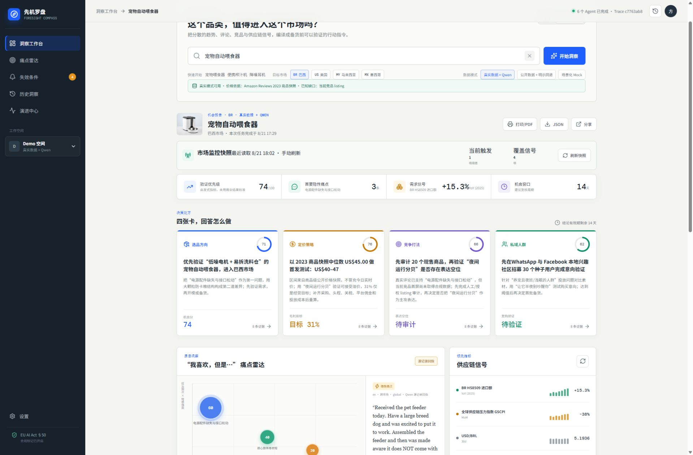
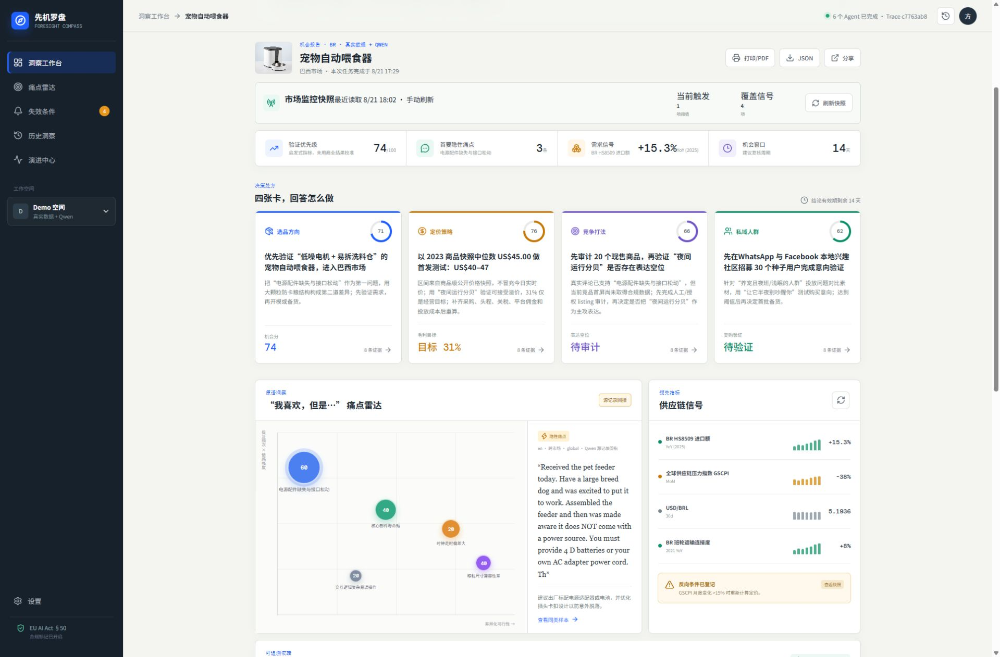
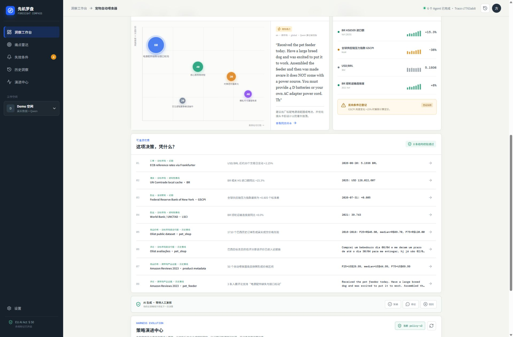
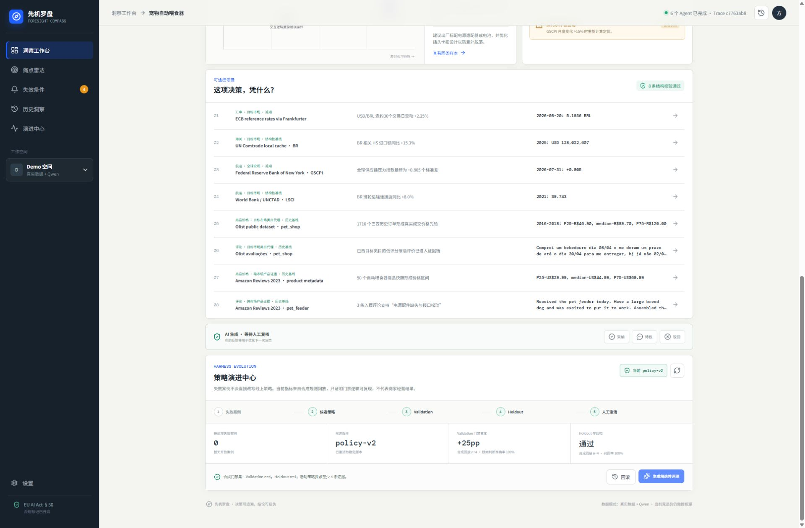

# 先机罗盘完整使用演示教程

> 适用版本：v1.0
> 团队：菜菜唠唠
> 主演示案例：宠物自动喂食器 × 巴西（BR）
> 适用对象：比赛评委、跨境商家、产品体验者与技术评审

## 一、教程目标

完成本教程后，体验者可以独立完成以下操作：

1. 启动先机罗盘前后端；
2. 选择品类、目标市场与数据模式；
3. 发起一项多 Agent 市场研究任务；
4. 阅读选品、定价、竞争和种子人群四类决策卡；
5. 下钻多语言评论、贸易、汇率和供应链证据；
6. 判断证据的新鲜度、适用市场和失效条件；
7. 对 AI 建议执行采纳、待议或驳回；
8. 查看策略演进中心的候选评测、激活和回滚机制；
9. 导出 PDF、JSON 或分享任务链接；
10. 理解后续接入实时接口时的更新与降级方式。

## 二、建议演示路线

### 路线 A：3 分钟产品体验

适合商家评委或 Idea 初审：

1. 打开工作台，说明“新品是否值得进入某个海外市场”的业务问题；
2. 选择 `宠物自动喂食器 × 巴西 × 真实数据 + Qwen`；
3. 展示四张决策卡；
4. 展示原语痛点与证据链；
5. 打开一条证据，说明观察时间、读取时间和市场范围；
6. 点击“待议”或“驳回”，展示人工复核闭环；
7. 用一句话总结：先验证、再投入，并给出停止条件。

### 路线 B：8 分钟完整演示

适合技术评委或复赛答辩：

1. 完成路线 A；
2. 展示任务 SSE 进度与六类 Agent 分工；
3. 展示市场快照和阈值触发计数；
4. 展示 Trace、Checkpoint 与组件快照；
5. 驳回一张卡，生成候选策略并执行 Validation/Holdout 回放；
6. 说明 Provider 热更新、旧任务版本锁定与回滚；
7. 切换另一个品类或市场，证明不是固定报告模板。

## 三、运行环境

### 1. 推荐环境

- Windows 10/11、macOS 或 Linux；
- Python 3.11 及以上；
- Node.js 20 及以上；
- 现代浏览器；
- Docker Desktop 为可选项。

### 2. 访问地址

| 服务 | 地址 |
|---|---|
| 产品工作台 | `http://127.0.0.1:4173` |
| 后端 API | `http://127.0.0.1:8000` |
| OpenAPI 文档 | `http://127.0.0.1:8000/docs` |
| 健康检查 | `http://127.0.0.1:8000/api/v1/health` |

## 四、启动方式

### 方式一：一键本地演示

在项目根目录打开 PowerShell：

```powershell
.\scripts\run_demo.ps1
```

脚本启动后访问 `http://127.0.0.1:4173`。

### 方式二：Docker Compose

```powershell
git clone https://github.com/royd132/xianjiluopan.git
cd xianjiluopan
docker compose up --build
```

### 方式三：分别启动前后端

终端一启动后端：

```powershell
$env:PYTHONPATH="backend"
python -m uvicorn foresight.api:app --host 0.0.0.0 --port 8000
```

终端二启动前端：

```powershell
npm.cmd install
npm.cmd run dev -- --port 4173
```

工作台右上角显示“6 个 Agent 已完成”或任务进度时，说明 Runtime 已连接。后端未连接时，页面会进入本地演示能力，不能把该状态描述成真实数据任务。

## 五、三种数据模式

| 模式 | 适用情况 | 行为边界 |
|---|---|---|
| 真实数据 + Qwen | 已下载所需数据且配置模型密钥 | 缺少数据或模型调用失败时明确报错，不静默伪造 |
| 公开数据 + 明示回退 | 部分真实数据可用 | 优先使用公开数据，缺口使用明确标记的冷启动规则 |
| 场景化 Mock | 无网络、无密钥的稳定演示 | 经过同一 Agent 与门禁流程，但所有证据明确标记为 Mock |

首次演示建议先用 Mock 验证环境，再切换 Real 展示真实链路。比赛现场不要临时下载大数据集。

## 六、创建研究任务

1. 在搜索框输入品类，例如“宠物自动喂食器”；
2. 在目标市场中选择 `BR 巴西`；
3. 选择数据模式；
4. 阅读搜索框下方的能力提示；
5. 点击“开始洞察”；
6. 等待 Collector、Review、Market、Supply Chain、Decision 和 Safety 六类 Agent 完成。

如果 Real 按钮不可用，表示当前“市场 × 品类”不满足真实数据合同。此时应补充数据，或主动选择 Hybrid/Mock，不能把回退结果讲成真实报告。



### 运行中应观察什么

- 页面显示当前完成的 Agent 数量；
- 任务拥有唯一 Trace ID；
- 前端通过 SSE 接收 Runtime 事件；
- 中断任务可以从最近 Checkpoint 恢复；
- 报告生成后 URL 出现 `?task=任务ID`，可用于分享和复现。

## 七、阅读报告摘要

报告头部包含品类、市场、生成时间、数据模式和市场监控快照。四个摘要指标用于快速判断：

| 指标 | 含义 | 演示时的正确说法 |
|---|---|---|
| 验证优先级 | 当前建议进入验证阶段的综合分 | 不是销量预测，而是验证排序 |
| 需要性痛点 | 具有需求与缺陷双重信息的痛点数量 | 代表可验证的问题，不等于全部用户共识 |
| 需求信号 | 贸易或市场需求变化 | 必须同时说明观察期和来源 |
| 机会窗口 | 建议重新检查结论前的有效期 | 不是保证获利的时间窗口 |

点击“刷新快照”可重新读取当前市场信号。原型实现的是手动刷新与阈值触发计数；生产环境再接入定时任务、Webhook 或 WebSocket。

## 八、理解四张决策卡



### 1. 选品方向

回答“应该优先验证哪个产品差异”。

重点查看：

- 推荐差异是否来自真实痛点；
- 是否有至少三条证据；
- 是否包含可执行的样品或访谈验证；
- 哪个指标变化会推翻建议。

### 2. 定价策略

回答“以什么区间开始测试”。

价格区间只是一阶段测试锚点。做经营决策前仍需补充采购、头程、关税、平台佣金、退货、广告和汇率缓冲。

### 3. 竞争打法

回答“应该审计或攻击哪个表达空位”。

如果没有目标市场当前 listing 授权数据，系统会生成“审计若干现售商品”的验证任务，而不会编造竞品 Top 10。

### 4. 种子人群

回答“先找谁、在哪里找、用什么话术测试意向”。

建议先完成 30 份意向测试和 5 次深访，再决定首批备货。种子验证结果是下一轮输入，不是自动投放指令。

### 打开卡片详情

点击任意决策卡，可查看：

- 完整行动建议；
- 证据链；
- 置信度与有效期；
- 反向条件；
- 人工复核按钮；
- 可复制的决策摘要。

## 九、查看多语言痛点与供应链信号



“我喜欢，但是……”痛点雷达用于发现让步结构：用户认可整体价值，但指出一个影响使用的具体缺陷。这类信息比只统计一星差评更适合形成差异化假设。

演示时应说明：

1. Review Agent 分析英语、葡萄牙语等原语；
2. 模型只返回支持结论的记录 ID；
3. 原文由代码从输入记录取回，避免模型伪造引文；
4. 跨市场评论会标记为“跨市场产品证据”，不能直接代表巴西用户占比。

右侧供应链信号展示贸易、汇率、全球压力指数和航运基线。不同信号的更新频率不同，不统一包装成“秒级实时”。

## 十、证据链下钻


点击任意一条证据，详情窗口会显示：

| 字段 | 判断问题 |
|---|---|
| 证据结论 | 这条数据支持了什么判断？ |
| 原始值 / 原语 | 是否能看到未经改写的数字或评论？ |
| 观察期 | 数据实际描述的是哪一段时间？ |
| 读取时间 | 系统在什么时候取得它？ |
| 时间属性 | 是近期证据、历史基线还是结构性基线？ |
| 来源市场 | 是目标市场、跨市场、类目代理还是全球信号？ |
| 证据类型 | 是来源证据还是模型派生证据？ |

### 证据可信度检查法

在现场任选一条证据，用下面四句话完成核查：

1. 来源是谁；
2. 原始值是什么；
3. 观察时间是什么；
4. 为什么适用于当前决策。

任何一项无法回答，都应降低置信度或转成待验证任务。

## 十一、人工复核

报告下方提供三种复核状态：

- **采纳**：建议可以进入下一步验证；
- **待议**：需要补充成本、样本或商家经验；
- **驳回**：当前证据不足或建议不适用。

复核状态会和卡片 ID、证据、任务 Trace、组件版本一起保存。驳回时会形成失败案例，但不会直接改写线上策略。

推荐现场演示“驳回”：

1. 打开一张决策卡；
2. 点击“驳回”；
3. 页面提示反馈已保存；
4. 进入策略演进中心，观察待处理失败案例增加。

## 十二、策略演进中心



演进流程分为五步：

1. 收集失败案例；
2. 根据案例生成候选策略；
3. 在 Validation 集上测试；
4. 在隔离的 Holdout 集上复测；
5. 人工确认后激活。

只有同时满足证据覆盖率、业务门禁和非回归要求的候选才允许激活。点击“回滚”可以恢复父版本。演示时必须强调：这是受控策略改进，不是让模型在生产环境自行改代码。

## 十三、导出与分享

报告右上角提供三个操作：

### 打印 / PDF

点击“打印/PDF”，在浏览器打印窗口选择“另存为 PDF”。适合提交给采购、供应链或管理层审批。

### JSON

点击“JSON”下载结构化报告。文件包含任务请求、四张卡、证据、痛点、供应链信号、Trace 和生成时间，适合接入 ERP、BI 或内部工作流。

### 分享

点击“分享”复制带任务 ID 的链接。同一台已保存任务数据的服务可以打开一致报告。生产部署时需要增加登录、租户隔离和链接有效期。

## 十四、实时接口接入后的工作方式

先机罗盘通过 Provider 协议接入数据源。不同数据按业务风险设置独立 SLA：

| 信号 | 推荐更新频率 | 典型接入方式 | 触发动作 |
|---|---|---|---|
| 汇率 | 秒级至分钟级 | WebSocket / 高频轮询 | 重算利润和定价卡 |
| 竞品价格、库存 | 5-30 分钟 | 平台授权 API / Webhook | 重算竞争和价格卡 |
| 评论、评分 | 15-60 分钟 | 增量 API / 游标轮询 | 更新痛点与置信度 |
| 物流与供应链 | 小时至日级 | 承运商 API / 指数源 | 更新交期和成本假设 |
| 海关贸易 | 官方发布周期 | 批量增量同步 | 更新结构性需求基线 |

数据过期时系统可以执行四种动作：继续展示但标记过期、降低置信度、局部重算、阻止高风险建议。Provider 更新采用 `staging → 健康检查 → activate`；运行中的旧任务仍锁定原组件版本。

## 十五、常见问题处理

### 1. 页面提示后端未连接

检查 `http://127.0.0.1:8000/api/v1/health`，确认后端端口没有被占用，并重新运行启动脚本。

### 2. Real 模式不可选

当前品类或市场缺少真实数据缓存、模型密钥或能力矩阵配置。先使用 Mock 验证功能，再按 `docs/真实数据与冷启动.md` 下载数据。

### 3. 任务长时间没有完成

检查后端日志和 `/api/v1/research/{id}`。如果已有 Checkpoint，可调用恢复接口；不要反复提交相同任务。

### 4. 报告没有当前竞品价格

这通常意味着尚未接入目标平台授权 listing API。系统应输出竞品审计任务，而不是补造实时价格。

### 5. 点击生成候选无结果

需要先驳回至少一张真实 Runtime 决策卡，形成开放失败案例。只读演示环境会禁用策略变更接口。

### 6. 分享链接在另一台机器打不开

任务结果当前保存在运行该后端的实例中。跨机器分享需要部署公共服务并使用持久化数据库。

## 十六、演示边界

当前已经实现：

- React 工作台、FastAPI、SSE 和六类 Agent；
- Real / Hybrid / Mock 数据合同；
- Qwen Grounding 与多语言评论回指；
- 证据时间、适用范围和新鲜度标记；
- Trace、Checkpoint、组件快照、热更新和回滚；
- 人工复核与策略级受控演进；
- PDF、JSON 和任务链接导出；
- 自动化测试与 GitHub Actions。

当前仍需后续接入：

- 目标平台授权的实时 listing、价格和库存接口；
- 后台定时增量调度与通知；
- 更多国家的原生评论覆盖；
- 真实商家经营效果校准；
- 生产级账号、租户和权限系统。

## 十七、演示结束语

> 先机罗盘不替卖家自动下单，也不把历史数据包装成实时事实。它在不可逆投入之前，把“我感觉能卖”变成三个可以检查的问题：哪些证据支持、下一步先验证什么、什么情况下应该停止。

项目仓库：https://github.com/royd132/xianjiluopan
