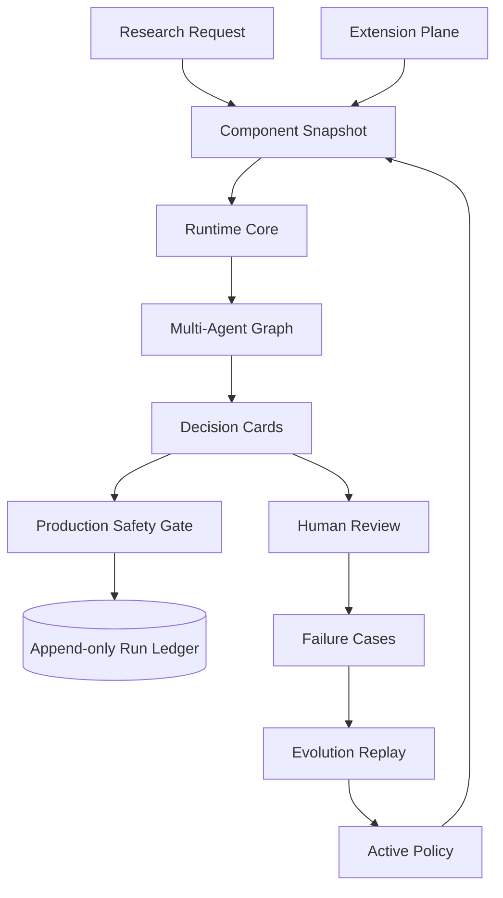
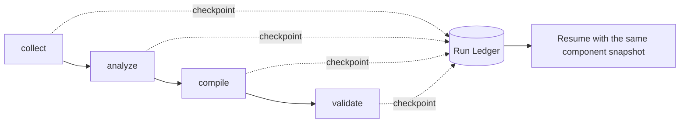

# Harness、热插拔与受控自进化 v3

> 实现日期：2026-08-14
> 架构路线：EvoAgent 式可靠内核 + DSH 式扩展平面 + 生产门禁约束的策略演进。

## 1. 为什么采用组合架构

先机罗盘没有把整个系统做成插件，也没有让模型生成任意可执行代码。运行可靠性和能力替换属于两个不同问题：

- Runtime Core 负责节点状态、重试、取消、Checkpoint、Run Ledger 和恢复；
- Extension Plane 负责 Provider、Tool、Evaluator 和 Policy Pack 的可逆装配；
- Evolution Plane 负责失败案例、候选生成、真实决策卡回放、激活和回滚；
- Agent Graph 保留稳定的市场洞察业务流程，不在运行中替换核心状态机。

## 2. 总体架构



## 3. 作用域与能力解析

每个任务固定以下作用域链：

```text
global -> tenant/workspace -> market preset -> task
```

工具从当前任务向上查找，离任务最近的同名注册覆盖上层版本。例如巴西市场可以覆盖全局数据 Provider，但不能读取其他 workspace 的密钥或记忆。

`CapabilityGuard` 在工具解析后统一执行。拒绝是单调的：只要任意 Guard 拒绝，后续作用域或同名工具都不能重新放行。当前核心 Guard 只允许：

- `mock_data`
- `statistics`
- `memory_read`
- `memory_write`

## 4. 可逆插件生命周期

插件安装经过：

```text
Manifest 校验 -> Staging 注册 -> Health Check -> 激活 -> 新任务可见
                         |失败
                         v
                  EffectStack 逆序清理
```

插件注册的工具和 Guard 都进入 `EffectStack`。安装失败时按注册逆序撤销；新版本激活时旧版本进入 `retired`，不会立即删除，因为已有任务的组件快照仍可能引用它。

当前允许插件化的边界：

| 类型 | 状态 |
|---|---|
| Data Provider | 已实现 |
| Tool | 已实现 |
| Evaluator | 已预留 Manifest 类型 |
| Policy Pack | 已预留 Manifest 类型 |
| Agent Adapter | 已预留 Manifest 类型 |
| 核心任务状态机 | 不允许热替换 |
| Run Ledger / Checkpoint | 不允许热替换 |
| 任意代码执行 / Code Mode | 不实现 |

## 5. 新任务生效的热更新

Provider 更新不会修改正在运行的任务：

1. 任务创建时生成 `ComponentSnapshot`；
2. 快照记录作用域、插件版本、工具注册身份、策略版本和整体 SHA-256；
3. 新 Provider 激活后，仅新任务解析到新版本；
4. 旧任务继续使用快照锁定的 Tool generation；
5. 服务重启后，根据快照中的插件身份重建 retired generation；
6. 当前活动 Provider 版本写入 Memory Store，重启不会偷偷退回旧版；
7. 回滚只切换新任务的默认 generation，旧任务仍保持原快照。

相关接口：

| 方法 | 路径 | 说明 |
|---|---|---|
| GET | `/api/v1/runtime/extensions` | 查看活动和退役插件版本 |
| POST | `/api/v1/runtime/providers/mock/reload` | 安装内置 Mock Provider 新版本 |
| POST | `/api/v1/runtime/providers/mock/rollback` | 回滚上一个 Provider generation |
| GET | `/api/v1/research/{id}/component-snapshot` | 查看任务固定的组件快照 |

热更新接口只装载仓库内置 Provider，不接受外部模块路径、上传代码或模型生成代码。

## 6. 可恢复运行时



每个节点记录 `running / completed / failed / cancelled`、输入哈希、尝试次数、输出和错误。节点输入哈希包含工作流版本、策略版本和组件快照摘要，因此组件不一致时不会错误复用旧输出。

SQLite 使用 WAL 和 `synchronous=NORMAL`，任务期间复用已打开连接并逐次提交，任务结束后关闭连接，兼顾运行状态可见性和 Windows 文件句柄安全。

## 7. 真实决策卡回放

v2 使用汇总后的布尔字段模拟发布判断。v3 改为构造完整的：

- `DecisionCard`
- `EvidenceItem`
- `PrivateDomainHook`
- `FailureCondition`

然后调用线上 `SafetyEvaluationAgent` 使用的同一个 `evaluate_decision_cards()` 生产门禁：

```text
DecisionCard Schema -> Production Safety Gate -> Publish / Reject
```

Validation 保留逐案例结果，Holdout 只返回聚合指标。每次演进记录候选策略、基线策略和两个数据分区的 SHA-256，便于复现。

候选只有同时满足以下条件才进入 `ready`：

1. Validation Accuracy 至少提升 5%；
2. Validation Precision 不退化；
3. Holdout Accuracy 不退化；
4. Holdout Recall 退化不超过 5%；
5. Holdout 错误发布率不升高；
6. 人工调用激活接口后才成为活动策略。

## 8. 已实现边界

这版实现的是可验证的策略与能力演进，不是模型权重训练。系统不会自动执行 SFT、LoRA 或 Agentic RL，也不会修改核心 Runtime 代码。真实业务接入前仍需补充：

- 按 workspace 隔离的生产凭据和 Memory；
- 真实 Provider 的授权、限流与数据许可；
- 更大规模、按国家和品类隔离的回放数据集；
- 分布式任务队列下的插件 generation 租约；
- 管理员认证和发布审批。
