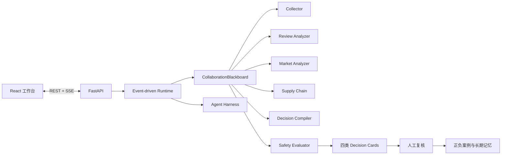

# 先机罗盘：创意初赛提交材料

> 参赛场景：场景三「AI 市场洞察」
>
> 方案名称：先机罗盘：跨境新品首单前的证据决策系统
> 英文名：Foresight Compass · 版本：v1.3 · 2026-08-24

## 1. 基本信息

| 字段 | 内容 |
|---|---|
| 团队名称 | 菜菜唠唠 |
| 队长姓名 | 邹柏良 |
| 联系电话 | 13204942689 |
| 团队成员 | 周展序、向顺、庞佳轩、董志兵 |
| 参赛场景 | 场景三：AI 市场洞察 |
| 方案名称 | 先机罗盘：跨境新品首单前的证据决策系统 |

## 2. 方案概述

### 2.1 一句话定位

先机罗盘面向缺少海外研究团队的中小跨境卖家，在样品、开模和首批备货前，将原语评论、竞品价格、贸易、汇率与物流信号编译为可追溯、可过期、可推翻的 `Go / Validate / Stop` 决策。

### 2.2 业务问题

跨境卖家进入陌生市场时，需要同时理解趋势、竞品、价格、当地语言评论、海关和供应链变化。真正高风险的时刻不是“看报告”，而是准备付样品费、开模、备货和投放时。现有工具大多提供榜单或单项指标，卖家仍需依赖经验完成最后的决策拼装，容易出现五个问题：

1. 数据分散且多语言，研究周期长，难以形成统一判断；
2. AI 能生成建议，却不能稳定回指原始评论和数值来源；
3. 历史快照、跨市场证据和近期数据容易被混成“实时事实”；
4. 报告停在描述市场，没有给出下一步验证动作和停止条件；
5. 市场变化后旧结论继续流通，无法自动进入重算或复核流程。

### 2.3 目标用户

- **核心用户**：1–5 人、没有海外本地研究团队、准备把成熟供应链带入陌生市场的中小跨境卖家。

工厂型卖家、代运营和出海服务商属于后续扩展客户。

### 2.4 五项核心功能

1. **新品进入诊断**：输入品类与目标国家，围绕首批投入输出 `Go / Validate / Stop` 结论、证据冲突和待补信息。
2. **原语隐性痛点雷达**：直接分析当地语言评论；模型只返回支持结论的 review ID，原文由代码取回。
3. **选品、定价与竞争处方**：回答优先验证什么差异、以什么区间试价、审计或攻击哪个竞争空位。
4. **最小市场验证卡**：给出验证人群、渠道、样本量、验证问题和停止条件，帮助卖家先验证再备货。
5. **决策有效期监控**：记录证据时间、适用范围与过期时间；关键变化越过阈值后只重算受影响卡片。

### 2.5 创新亮点

- **原语证据 Grounding**：模型只提交源记录 ID，原文与数值由代码取回；
- **可证伪决策处方**：每条建议同时给出行动、证据、有效期和推翻条件；
- **变化触发局部重算**：为不同数据定义新鲜度合同，只更新受影响结论。

多 Agent、Harness、Provider 热更新与受控演进作为可信技术底座，保证决策链可恢复、可审计、可复现和可回滚，不占用产品核心功能名额。

### 2.6 预期效果

以下指标为首轮商家试点目标，不是已经取得的经营结果：

| 指标 | 传统方式 | 目标 |
|---|---:|---:|
| 单品类 × 单市场端到端研究 | 2–3 个工作日 | 数据就绪后 60–90 秒生成首版；含人工复核控制在 2 小时内 |
| 核心建议可追溯率 | 依赖人工整理 | 100% 绑定证据对象 |
| 备货前最小验证 | 经常直接投入 | 80% 试点任务完成验证计划 |
| 失效结论处置 | 依赖人工记忆 | 100% 过期卡片进入重算或人工复核队列 |

当前原型保留“品类画像 × 市场画像”Mock 作为离线保险，同时已跑通 BR × 自动宠物喂食器的真实闭环：50 个严格匹配商品、23 个有效价格、75 条同商品评论、650 条 Olist 葡语评论、1,710 个巴西历史订单，以及 Comtrade、ECB 汇率、GSCPI、LSCI 和 Qwen。当前竞品 listing 覆盖率不可得时，系统生成“审计 20 个现售商品”的验证任务，不输出伪造的 Top 10 空位。

### 2.7 商业价值与验证方式

- **减少错误备货**：在下首批订单前先完成 30 份意向测试与 5 次深访；
- **缩短研究时间**：数据就绪后 60–90 秒生成首版，含数据确认和人工复核的端到端流程目标控制在 2 小时内；
- **提高决策可追溯性**：所有发布建议关联证据、时间、组件版本和反向条件；
- **让失败变成资产**：驳回原因进入失败案例库，但必须经过 Validation/Holdout 与人工激活才能改变策略。

首轮计划招募 10 位中小卖家，覆盖 3 个品类和 3 个市场，对比使用前后的研究耗时、证据覆盖率、卡片采纳率、最小验证完成率与停止证据不足项目数。

## 3. 技术方案

### 3.1 总体架构

### 3.2 Agent 工作流

1. Collector Agent 采集趋势、评论、价格、贸易与运价数据；
2. Review Analyzer、Market Analyzer 和 Supply Chain Agent 并行发布分析 Artifact；
3. Decision Compiler 只基于黑板中的结构化事实生成四类卡片；
4. Safety Evaluator 检查证据、非英语来源、最小验证要素、反向条件和 AI 标记；
5. Harness 在关键阶段保存 Checkpoint，并记录完整 Trace；
6. 前端通过 SSE 接收任务执行事件；
7. 用户复核结果写入正向或负向案例库。

### 3.3 模型与数据能力

| 能力 | 拟使用方案 |
|---|---|
| 多语言语义理解 | Qwen DashScope Model Adapter；JSON 输出、Prompt Injection 防护、源 review ID Grounding |
| 结构化决策生成 | JSON Schema/Pydantic 约束输出 |
| 数值统计 | Python/Pandas 与确定性规则 |
| 文本检索 | 多语言 Embedding + ChromaDB，后续可升级 Qdrant |
| 数据源 | Amazon Reviews 2023 商品/评论、Olist 葡语评论与成交、UN Comtrade、ECB、NY Fed GSCPI、World Bank LSCI |
| 服务端 | FastAPI、SSE、SQLite/PostgreSQL |
| 前端 | React + Vite |

系统不会让模型负责精确数值计算。模型用于语义理解和策略编译，统计与阈值由确定性代码完成。

### 3.4 Harness 能力

- Context Governance：控制 Agent 可读取的上下文和 Artifact；
- TraceWriter：记录任务、Agent、事件和异常；
- MemoryStore：沉淀研究结果、人工反馈与案例；
- Checkpoint：在采集、分析和校验阶段保存快照；
- Tool Policy：限制 Agent 可使用的工具；
- Scoped Registry：按 global/workspace/market/task 解析和遮蔽能力；
- Capability Guard：拒绝结果不可被更近作用域重新放行；
- Effect Stack：插件安装失败或回滚时逆序撤销注册；
- Component Snapshot：固定每个任务的 Provider、工具和策略版本；
- Evaluation Gate：不满足强制 Schema 时拒绝输出。

### 3.5 自进化路线

- Layer 1 已实现：采纳、驳回、待议等运行时反馈收集；
- Layer 2 已实现：正向/负向案例写入长期记忆；
- Layer 3a 已实现：版本化策略候选、外置合成决策卡 Validation/Holdout 回放、人工激活和父版本回滚；
- Layer 3b 规划：在积累足够合规样本后再评估 Prompt/Skill 优化、SFT/LoRA 和 Agentic RL。

## 4. 可行性

仓库已经提供 React 工作台、FastAPI/SSE、多 Agent Runtime、Harness v3、作用域插件扩展面、任务组件快照、四卡 Schema、Mock/Hybrid/Real Provider、Qwen Model Adapter、公开数据下载脚本、Provider 热更新、策略回放、CLI、测试和真实报告。下一阶段重点是当前 listing 授权源、定时增量和商家真实审核集，不需要重写核心工作流。

## 5. 附加材料

- 可运行代码仓库；
- 浏览器工作台；
- OpenAPI 文档；
- 离线 JSON 报告；
- Runtime Trace 与 Checkpoint；
- 系统架构、Agent 协议、开发指南和演示脚本。

代码仓库地址可以填写为附加材料。对外提交前应移除密钥与个人数据，并确保评委拥有访问权限。

## 6. 300 字摘要

先机罗盘是面向中小跨境卖家的新品首单前证据决策系统。卖家输入品类与目标国家，系统将商品价格、原语评论、贸易、汇率和供应链信号编译为 `Go / Validate / Stop` 判断，以及选品、定价、竞争和最小市场验证四类卡片。模型只返回支持结论的源记录 ID，原文与数值由代码取回；每张卡记录证据时间、市场范围、有效期和反向条件，市场变化后可触发局部重算。多 Agent 负责专业分析，Harness 负责 Trace、Checkpoint、工具权限、组件快照和回滚。当前原型已跑通巴西宠物自动喂食器真实链路，缺少当前竞品授权数据时会生成补数任务，不伪造实时事实。
