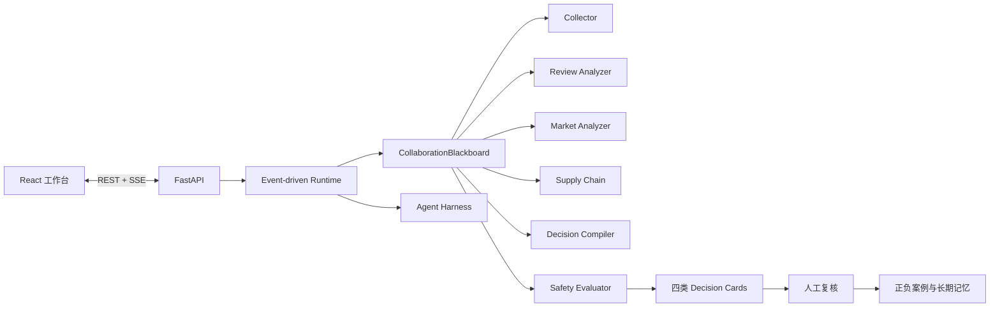

# 先机罗盘：创意初赛提交材料

> 参赛场景：场景三「AI 市场洞察」  
> 方案名称：先机罗盘 · Foresight Compass  
> 版本：v1.0 · 2026-08-14

## 1. 基本信息

| 字段 | 内容 |
|---|---|
| 团队名称 | 菜菜唠唠 |
| 队长姓名 | 邹柏良 |
| 联系电话 | 13204942689 |
| 团队成员 | 无（单人参赛） |
| 参赛场景 | 场景三：AI 市场洞察 |
| 方案名称 | 先机罗盘 · Foresight Compass |

## 2. 方案概述

### 2.1 一句话定位

先机罗盘把全球多语言公开数据编译成中小跨境卖家今天就能执行的选品、定价、竞争和私域人群决策，并为每条结论附上证据链、有效期、反向条件和人工复核状态。

### 2.2 业务问题

跨境卖家进入陌生市场时，需要同时理解趋势、竞品、价格、当地语言评论、海关和供应链变化。现有工具大多提供榜单或单项指标，卖家仍需依赖经验完成最后的决策拼装，容易出现三个问题：

1. 看到了数据，但不知道今天具体应该怎么做；
2. AI 或报告给出结论，却无法追溯原始依据；
3. 市场已经变化，旧结论仍被继续使用。

### 2.3 目标用户

- 1–5 人的中小跨境卖家；
- 正在将成熟商品迁移到新国家的平台卖家；
- 有产能、缺少海外市场研究能力的工厂型卖家；
- 需要批量交付市场研究的代运营与出海服务商。

### 2.4 五项核心功能

1. **事件驱动多 Agent 全球洞察**：采集、原语评论、市场、供应链、决策和安全 Agent 通过共享黑板协作。
2. **四类决策卡**：输出选品方向、定价策略、竞争打法和私域人群，不停留在描述性数据。
3. **多语言隐性痛点雷达**：直接分析葡萄牙语、西班牙语、英语等原始评论中的“喜欢，但是……”结构。
4. **证据链与可证伪机制**：每张卡强制包含至少三条证据、非英语来源、有效期和失效条件。
5. **Harness 与受控自进化飞轮**：统一管理 Run Ledger、Checkpoint、组件快照、作用域工具安全、人工反馈和候选策略回放。

### 2.5 创新亮点

- **处方级输出**：把“市场发生了什么”升级为“卖家应该怎么做”；
- **原语痛点挖掘**：避免翻译摘要丢失当地消费者的语境；
- **私域落点强制化**：每张卡回答“找谁、在哪找、第一句话说什么”；
- **结论可证伪**：主动说明系统会在什么条件下判断自己已经错了；
- **可治理多 Agent**：不是自由聊天式 Agent，而是由黑板事件、Schema 闸门和 Harness 约束的工程系统；
- **运行时能力可替换**：Provider 经过 staging、健康检查和 Effect 逆序清理完成热更新，只影响新任务；
- **演进结果可复现**：候选策略使用完整 DecisionCard 经过线上同一 Safety Gate 回放，并记录 Validation/Holdout 指纹；
- **离线可复现**：没有 API Key 时仍能通过确定性 Mock 数据运行完整链路。

### 2.6 预期效果

| 指标 | 传统方式 | 目标 |
|---|---:|---:|
| 单品类 × 单市场初步研究 | 2–3 个工作日 | 60–90 秒生成首版四卡 |
| 核心建议可追溯率 | 依赖人工整理 | 100% 绑定证据对象 |
| 非英语评论利用 | 常被忽略 | 至少覆盖 4 种语言 |
| 结论更新 | 人工重新检查 | 反向条件触发提醒 |
| 任务中断恢复 | 通常从头开始 | 阶段 Checkpoint 恢复 |
| Provider 更新 | 重启并影响全部任务 | 新任务切换，旧任务锁定组件快照 |

以上为产品目标。当前原型使用明确标记的确定性 Mock 数据验证完整流程，不将模拟数据包装为真实实时结果。

## 3. 技术方案

### 3.1 总体架构

### 3.2 Agent 工作流

1. Collector Agent 采集趋势、评论、价格、贸易与运价数据；
2. Review Analyzer、Market Analyzer 和 Supply Chain Agent 并行发布分析 Artifact；
3. Decision Compiler 只基于黑板中的结构化事实生成四类卡片；
4. Safety Evaluator 检查证据、非英语来源、私域钩子、反向条件和 AI 标记；
5. Harness 在关键阶段保存 Checkpoint，并记录完整 Trace；
6. 前端通过 SSE 接收实时事件；
7. 用户复核结果写入正向或负向案例库。

### 3.3 模型与数据能力

| 能力 | 拟使用方案 |
|---|---|
| 多语言语义理解 | Gemini Flash / Qwen 等可替换模型适配器 |
| 结构化决策生成 | JSON Schema/Pydantic 约束输出 |
| 数值统计 | Python/Pandas 与确定性规则 |
| 文本检索 | 多语言 Embedding + ChromaDB，后续可升级 Qdrant |
| 数据源 | 趋势、公开评论、UN Comtrade、FBX/SCFI、公开商品价格 |
| 服务端 | FastAPI、SSE、SQLite/PostgreSQL |
| 前端 | React + Vite |

系统不会让模型负责精确数值计算。模型用于语义理解和策略编译，统计与阈值由确定性代码完成。

### 3.4 Harness 能力

- Context Governance：控制 Agent 可读取的上下文和 Artifact；
- TraceWriter：记录任务、Agent、事件和异常；
- MemoryStore：沉淀研究结果、人工反馈与案例；
- Checkpoint：在采集、分析和校验阶段保存快照；
- Tool Policy：限制 Agent 可使用的工具；
- Scoped Registry：按 global/workspace/market/task 解析和遮蔽能力；
- Capability Guard：拒绝结果不可被更近作用域重新放行；
- Effect Stack：插件安装失败或回滚时逆序撤销注册；
- Component Snapshot：固定每个任务的 Provider、工具和策略版本；
- Evaluation Gate：不满足强制 Schema 时拒绝输出。

### 3.5 自进化路线

- Layer 1 已实现：采纳、驳回、待议等运行时反馈收集；
- Layer 2 已实现：正向/负向案例写入长期记忆；
- Layer 3a 已实现：版本化策略候选、完整决策卡 Validation/Holdout 回放、人工激活和父版本回滚；
- Layer 3b 规划：在积累足够合规样本后再评估 Prompt/Skill 优化、SFT/LoRA 和 Agentic RL。

## 4. 可行性

仓库已经提供 React 工作台、FastAPI/SSE、多 Agent Runtime、Harness v3、作用域插件扩展面、任务组件快照、四卡 Schema、Mock Provider 热更新、策略回放、CLI、测试和示例报告。后续真实化的主要工作是实现授权数据 Provider 与模型 Adapter，不需要重写核心工作流。

## 5. 附加材料

- 可运行代码仓库；
- 浏览器工作台；
- OpenAPI 文档；
- 离线 JSON 报告；
- Runtime Trace 与 Checkpoint；
- 系统架构、Agent 协议、开发指南和演示脚本。

代码仓库地址可以填写为附加材料。对外提交前应移除密钥与个人数据，并确保评委拥有访问权限。

## 6. 300 字摘要

先机罗盘是一套面向中小跨境卖家的证据驱动多 Agent 市场洞察系统。卖家输入品类与目标国家后，六类 Agent 通过事件黑板协作，把趋势、价格、多语言评论、海关和运价信号编译为选品、定价、竞争和私域人群四类决策卡。每张卡强制携带证据、非英语来源、有效期、私域钩子和反向条件。Harness v3 提供 Run Ledger、Checkpoint、作用域工具治理和任务组件快照；Provider 热更新只影响新任务。人工驳回会形成失败案例，候选策略必须使用完整决策卡通过 Validation 提升与 Holdout 非回归门禁，才能人工激活并支持回滚。仓库可无 API Key 离线复现完整链路。
