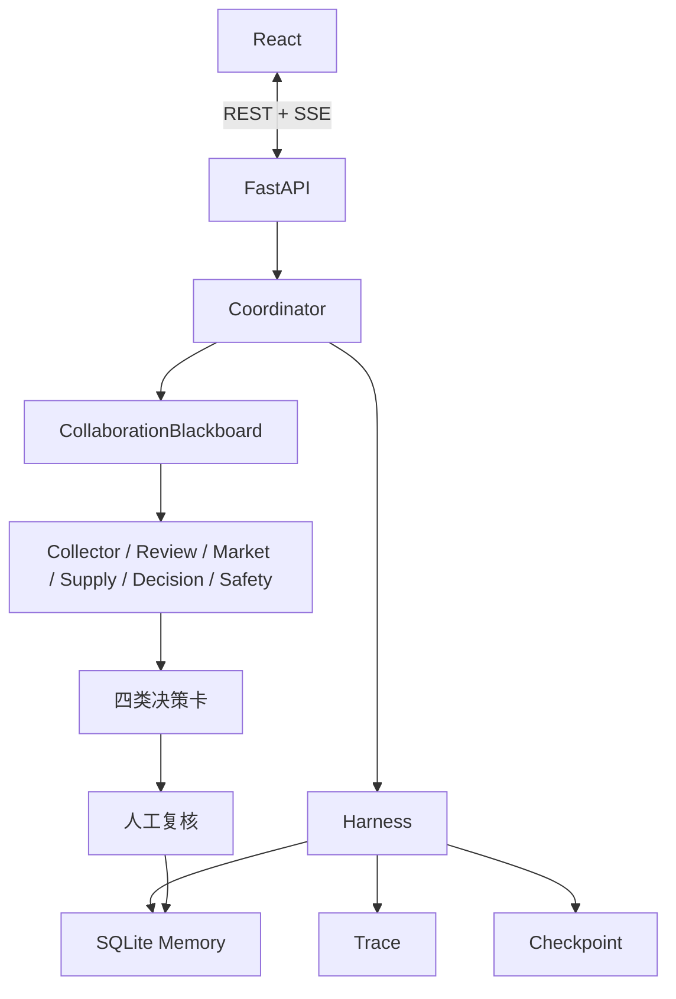

# 先机罗盘技术方案

完整技术说明已拆分为以下文档：

- [系统架构](系统架构.md)：分层架构、运行流程、Harness 和可观测性；
- [Harness、热插拔与受控自进化 v3](Harness与自进化_v3.md)：作用域扩展、组件快照、生产回放、激活与回滚；
- [Agent 与事件协议](Agent与事件协议.md)：Agent 契约、Artifact、事件和评测闸门；
- [开发指南](开发指南.md)：运行、测试、真实数据和模型扩展；
- [完整 PRD](PRD_先机罗盘_v1.0.md)：产品、数据、API、Harness、Runtime 与自进化的完整设计。

## 技术路线摘要

核心代码位于 `backend/foresight/`。Runtime 开放 `mock / hybrid / real` 三种数据合同。Collector 通过 Harness 工具注册表选择 `mock_data / hybrid_data / real_data`，Provider 不绕过权限、Trace、超时与组件快照。Real Provider 已接入 Amazon 商品/评论、Olist、UN Comtrade、ECB 汇率、NY Fed GSCPI、World Bank LSCI 和 Qwen；模型输出必须通过源 review ID Grounding，失败即拒绝真实任务。详细数据边界见[真实数据、冷启动与证据边界](真实数据与冷启动.md)。
