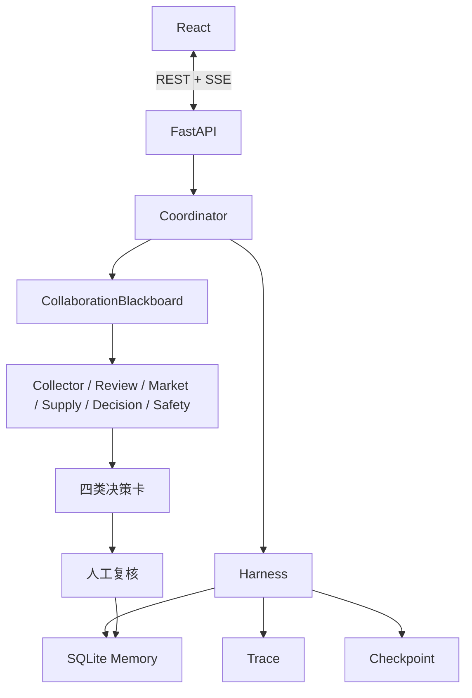

# 先机罗盘技术方案

完整技术说明已拆分为以下文档：

- [系统架构](系统架构.md)：分层架构、运行流程、Harness 和可观测性；
- [Harness、热插拔与受控自进化 v3](Harness与自进化_v3.md)：作用域扩展、组件快照、生产回放、激活与回滚；
- [Agent 与事件协议](Agent与事件协议.md)：Agent 契约、Artifact、事件和评测闸门；
- [开发指南](开发指南.md)：运行、测试、真实数据和模型扩展；
- [完整 PRD](PRD_先机罗盘_v1.0.md)：产品、数据、API、Harness、Runtime 与自进化的完整设计。

## 技术路线摘要

核心代码位于 `backend/foresight/`。默认 Mock 模式不需要外部模型或数据源，适合稳定演示和测试；当前 Runtime 只开放 `mock`，`real` / `hybrid` 在相应 Provider 安装前明确返回 `501`。真实化仍沿用统一 Provider 与 Model Adapter 扩展面，不改动 Agent 工作流。
