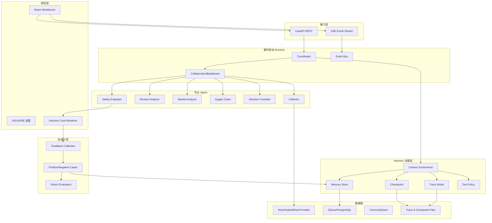

# 先机罗盘系统架构

## 1. 架构目标

系统要解决的不是一次性生成文案，而是让多个专业角色围绕同一个市场研究任务协作，并对过程进行治理、恢复、审计和评测。因此架构分为表现层、API 层、Runtime、Harness、Agent、数据与自进化六个部分。

## 2. 分层架构

## 3. 一次任务如何运行

1. Coordinator 创建任务、Trace 与 CollaborationBlackboard；
2. Collector Agent 获取数据并发布 `raw_market_data` 和 `evidences`；
3. Harness 保存 `collected` Checkpoint；
4. 评论、市场和供应链 Agent 并行读取原始数据并发布各自 Artifact；
5. Harness 保存 `analyzed` Checkpoint；
6. Decision Compiler 根据事实层编译四类卡片；
7. Safety Evaluator 强制验证证据数、非英语证据、私域钩子和失效条件；
8. 通过闸门后保存 `validated` Checkpoint 并发布完成事件；
9. 前端通过 SSE 实时展示进度，并通过 REST 获取最终结果；
10. 人工复核写入反馈记忆，形成正向或负向案例。

## 4. 为什么采用黑板模式

Agent 不互相直接调用，而是通过共享 Artifact 协作。这样可以：

- 并行运行互不依赖的分析；
- 追踪每一项中间结果由谁发布；
- 在单个 Agent 失败时降级或重试；
- 从 Checkpoint 恢复，而不重复全部采集；
- 将新的 Agent 插入工作流，而不修改其他 Agent 的实现。

## 5. Harness 职责

Harness 不是新的业务 Agent，而是所有 Agent 外面的治理层：

- `TraceWriter`：JSONL 记录任务、Agent 与 Checkpoint 事件；
- `MemoryStore`：SQLite 存储研究结果、复核卡片与正负案例；
- `CheckpointStore`：保存任务阶段快照；
- `Tool Policy`：限制 Agent 可使用的工具；
- `agent_span`：统一记录开始、结束和异常。

## 6. 数据演进

当前 `MockDataProvider` 提供稳定可复现的数据。接入真实数据时，新 Provider 必须返回同一结构：证据、评论、价格、贸易和运价数据。Agent 与 UI 不依赖具体供应商。

## 7. 可观测性

每次任务具有：

- `task_id`：外部任务标识；
- `trace_id`：审计链标识；
- 事件序列：前端进度与运行排查；
- Artifact 快照：Agent 协作状态；
- 三阶段 Checkpoint；
- 人工复核记录。

## 8. 当前实现与后续扩展

已经实现离线多 Agent Runtime、四卡、事件、Trace、Memory、Checkpoint、反馈沉淀和 API。真实数据连接器、向量数据库服务化、任务队列和模型适配器是自然扩展点，而非重新设计系统。
